# OAI 5G Core Deployment (Single Cluster - Multi Node)

## 1. Prerequisites

Deploy OAI 5G Core on a single Kubernetes cluster across multiple nodes.

- **OS:** Ubuntu 22.04.5 LTS

| Hostname | vCPU | RAM | HDD |
|---|---|---|---|
| oai-master | 4 vCPU | 8 GB | 40 GB |
| oai-cp (Control Plane) | 4 vCPU | 8 GB | 40 GB |
| oai-up (User Plane) | 4 vCPU | 8 GB | 40 GB |
| oai-an (Access Network) | 4 vCPU | 8 GB | 40 GB |

| Node | Deploy | NIC1 | NIC2 |
|---|---|---|---|
| oai-master | Kubernetes master node | Assigned IP | — |
| oai-cp | Control Plane NFs | Assigned IP | 10.100.50.11 |
| oai-up | UPF | Assigned IP | 10.100.50.21 |
| oai-an | gNB and UE | Assigned IP | 10.100.50.31 |

| Network Interface | CNI and Multus Interface | IP Pool |
|---|---|---|
| NIC1(ens3) | Cilium, N6 | NIC1 IP Pool(In this case 10.10.10.0/16) |
| NIC2(ens8) | N2, N3, N4 | 10.100.50.0/24 |

---

## 2. Install Kubernetes

### (1) Install Container Runtime (containerd) on All Nodes

```bash
# Run on: ALL nodes

sudo apt-get update

# Install required packages
sudo apt-get install -y curl ca-certificates gnupg

# Add Docker GPG key and repository
sudo install -m 0755 -d /etc/apt/keyrings
curl -fsSL https://download.docker.com/linux/ubuntu/gpg | sudo gpg --dearmor -o /etc/apt/keyrings/docker.gpg
sudo chmod a+r /etc/apt/keyrings/docker.gpg

echo "deb [arch=$(dpkg --print-architecture) signed-by=/etc/apt/keyrings/docker.gpg] https://download.docker.com/linux/ubuntu $(. /etc/os-release && echo "$VERSION_CODENAME") stable" | sudo tee /etc/apt/sources.list.d/docker.list > /dev/null

sudo apt-get update

# Install containerd
sudo apt-get install -y containerd.io

# Configure containerd with SystemdCgroup enabled
sudo mkdir -p /etc/containerd
sudo containerd config default | sudo tee /etc/containerd/config.toml
sudo sed -i "s/SystemdCgroup = false/SystemdCgroup = true/g" /etc/containerd/config.toml
sudo systemctl restart containerd
```

### (2) Install Kubernetes on All Nodes

```bash
# Run on: ALL nodes

# Add Kubernetes repository (v1.29)
curl -fsSL https://pkgs.k8s.io/core:/stable:/v1.29/deb/Release.key | sudo gpg --dearmor -o /etc/apt/keyrings/kubernetes-apt-keyring.gpg

echo 'deb [signed-by=/etc/apt/keyrings/kubernetes-apt-keyring.gpg] https://pkgs.k8s.io/core:/stable:/v1.29/deb/ /' | sudo tee /etc/apt/sources.list.d/kubernetes.list

sudo apt-get update

# Enable IPv4 forwarding and disable swap (required for Kubernetes)
sudo sysctl -w net.ipv4.ip_forward=1
sudo swapoff -a

# Enable bridge netfilter
sudo modprobe br_netfilter
sudo bash -c 'echo 1 > /proc/sys/net/bridge/bridge-nf-call-iptables'

# Install Kubernetes components
sudo apt-get install -y kubelet kubeadm kubectl

# Prevent automatic updates
sudo apt-mark hold kubelet kubeadm kubectl

# Verify installation
kubeadm version
kubelet --version
kubectl version --client
```

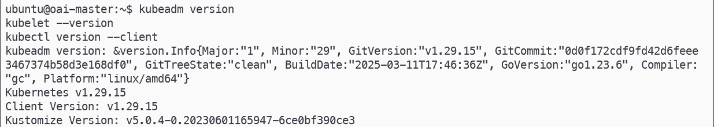

### (3) Initialize Kubernetes Cluster on Master Node

```bash
# Run on: oai-master

cd ~
vim config.yaml
```

```yaml
# config.yaml

apiVersion: kubeadm.k8s.io/v1beta3
kind: ClusterConfiguration
networking:
  podSubnet: "10.244.0.0/16"
  serviceSubnet: "10.96.0.0/16"
clusterName: "oai-core"
```

```bash
# Initialize the cluster
sudo kubeadm init --config=config.yaml --upload-certs | tee -a ~/k8s_init.log

# Configure kubectl access
mkdir -p $HOME/.kube
sudo cp -i /etc/kubernetes/admin.conf $HOME/.kube/config
sudo chown $USER:$USER $HOME/.kube/config
echo "export KUBECONFIG=$HOME/.kube/config" | tee -a ~/.bashrc
export KUBECONFIG=$HOME/.kube/config

# Note: Save the join command printed in k8s_init.log for worker nodes
```

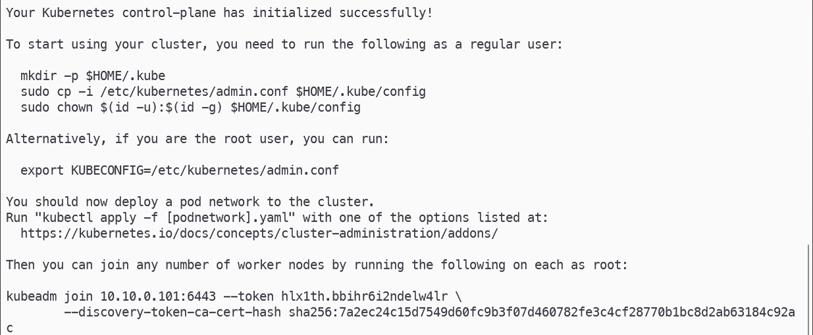

```bash
# Run on: oai-cp, oai-up, oai-an (Worker Nodes)

# Join each worker node to the cluster using the token from k8s_init.log
sudo kubeadm join <MASTER_NODE_IP>:<PORT> \
  --token <TOKEN> \
  --discovery-token-ca-cert-hash sha256:<HASH>
```

```bash
# Run on: oai-master
# Verify all nodes have joined successfully
kubectl get nodes -A
```

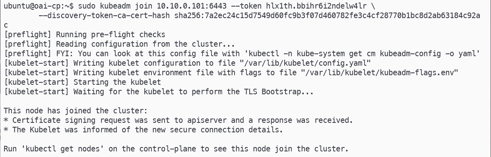

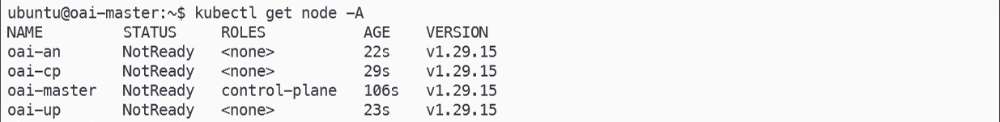

### (4) Deploy CNI (Cilium + Multus)

```bash
# Run on: oai-master

# Install Cilium CLI
curl -sL --remote-name https://github.com/cilium/cilium-cli/releases/latest/download/cilium-linux-amd64.tar.gz
tar xzf cilium-linux-amd64.tar.gz
sudo mv cilium /usr/local/bin/
rm cilium-linux-amd64.tar.gz

# Install Cilium with cni.exclusive=false to allow Multus to co-exist
cilium install \
  --set cni.exclusive=false

# Install Multus CNI
git clone https://github.com/k8snetworkplumbingwg/multus-cni.git && cd multus-cni
cat ./deployments/multus-daemonset.yml | kubectl apply -f -
cd ~

# Verify all pods are running
kubectl get pods -A
```

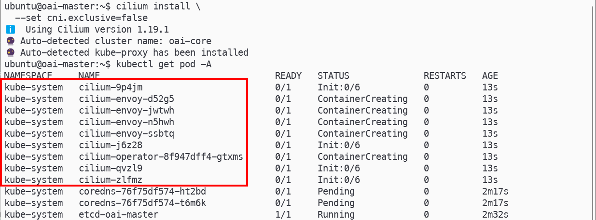

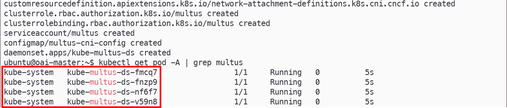

### (5) Create Namespaces and Install Helm

```bash
# Run on: oai-master

# Create namespaces for core and access network
kubectl create ns core && kubectl create ns an

# Install Helm 3
curl -fsSL -o get_helm.sh https://raw.githubusercontent.com/helm/helm/main/scripts/get-helm-3
bash ./get_helm.sh
rm ./get_helm.sh

helm version
```

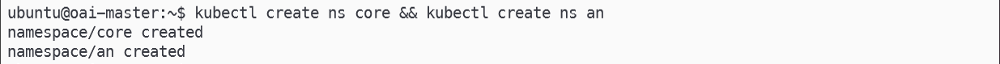

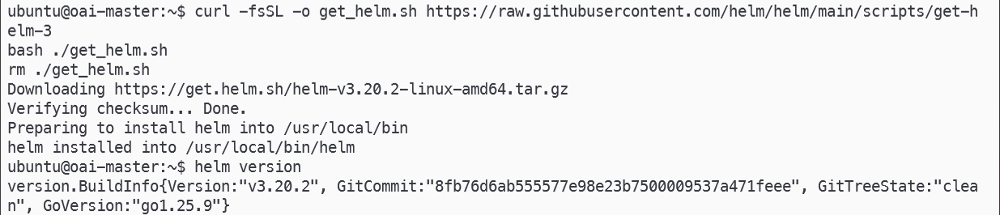

### (6) Clone oai-helm and Add ipvlan NAD Template

```bash
# Run on: oai-master

# Clone OAI helm charts
cd ~
git clone https://gitlab.eurecom.fr/oai/orchestration/charts.git oai-helm
cd ~/oai-helm/oai-5g-core/oai-5g-basic

# Add ipvlan NAD template to AMF, SMF, and UPF between the macvlan and vlan blocks
vim ../oai-amf/templates/nad.yaml
vim ../oai-smf/templates/nad.yaml
vim ../oai-upf/templates/nad.yaml

# Verify the ipvlan block was added correctly
cat ../oai-amf/templates/nad.yaml | grep ipvlan
cat ../oai-smf/templates/nad.yaml | grep ipvlan
cat ../oai-upf/templates/nad.yaml | grep ipvlan
```

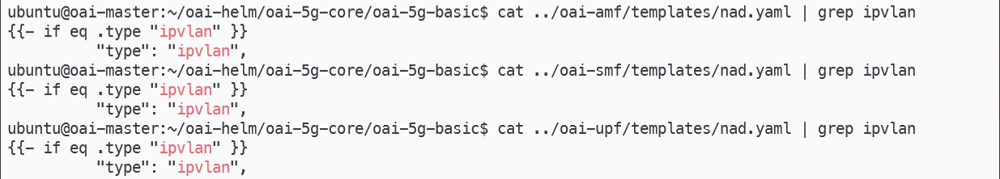

- ipvlan NAD template block to insert between macvlan and vlan sections:

```yaml
{{- if eq .type "ipvlan" }}
apiVersion: "k8s.cni.cncf.io/v1"
kind: NetworkAttachmentDefinition
metadata:
  name: {{ $.Release.Name }}-{{ .name }}
  labels:
    app: {{ $.Release.Name }}
spec:
  config: '{
      "cniVersion": "0.3.1",
      "name": "{{ $.Release.Name }}-{{ .name }}",
      "plugins": [
        {
          "type": "ipvlan",
          "master": "{{ .hostInterface }}",
          "mode": "{{ default "l2" .mode }}",
          "ipam": {
            "type": "static",
            "addresses": [
              { "address": "{{ .ipAdd }}/{{ .netmask }}" }
            ]
            {{- if .routes }},
            "routes": {{ toJson .routes }}
            {{- end }}
          }
        }
      ]
    }'
---
{{- end }}
```

<details>
<summary>nad.yaml — before adding ipvlan template</summary>

```yaml
# SPDX-License-Identifier: MIT

{{- if .Values.multus.enabled }}
{{- range .Values.multus.interfaces }}
{{- if .enabled }}
{{- if eq .type "macvlan" }}
apiVersion: "k8s.cni.cncf.io/v1"
kind: NetworkAttachmentDefinition
metadata:
  name: {{ $.Release.Name }}-{{ .name }}
  labels:
    app: {{ $.Release.Name }}
spec:
  config: '{
    "cniVersion": "0.3.1",
    "name": "{{ $.Release.Name }}-{{ .name }}",
    "plugins": [
      {
        "type": "macvlan",
        "master": "{{ .hostInterface }}",
        "mode": "{{ default "bridge" .mode }}",
        "ipam": {
          {{- if eq .ipAdd "dhcp" }}
          "type": "dhcp"
          {{- else }}
          "type": "static",
          "addresses": [
            { "address": "{{ .ipAdd }}/{{ .netmask }}" }
          ]
          {{- end }}
          {{- if .routes }},
          "routes": {{ toJson .routes }}
          {{- end }}
          {{- if .gateway }},
          "gateway": "{{ .gateway }}"
          {{- end }}
        }
      }
      ]
  }'
---
{{- end }}

{{- if eq .type "vlan" }}
apiVersion: "k8s.cni.cncf.io/v1"
kind: NetworkAttachmentDefinition
metadata:
  name: {{ $.Release.Name }}-{{ .name }}
  labels:
    app: {{ $.Release.Name }}
spec:
  config: '{
    "cniVersion": "0.3.1",
    "type": "vlan",
    "master": "{{ .hostInterface }}",
    "vlanId": {{ .vlan }},
    "ipam": {
      "type": "static",
      "addresses": [
        { "address": "{{ .ipAdd }}/{{ .netmask }}" }
      ]
      {{- if .routes }},
      "routes": {{ toJson .routes }}
      {{- end }}
      {{- if .gateway }},
      "gateway": "{{ .gateway }}"
      {{- end }}
    }
  }'
---
{{- end }}
{{- end }}
{{- end }}
{{- end }}
```

</details>

<details>
<summary>nad.yaml — after adding ipvlan template</summary>

```yaml
# SPDX-License-Identifier: MIT

{{- if .Values.multus.enabled }}
{{- range .Values.multus.interfaces }}
{{- if .enabled }}
{{- if eq .type "macvlan" }}
apiVersion: "k8s.cni.cncf.io/v1"
kind: NetworkAttachmentDefinition
metadata:
  name: {{ $.Release.Name }}-{{ .name }}
  labels:
    app: {{ $.Release.Name }}
spec:
  config: '{
    "cniVersion": "0.3.1",
    "name": "{{ $.Release.Name }}-{{ .name }}",
    "plugins": [
      {
        "type": "macvlan",
        "master": "{{ .hostInterface }}",
        "mode": "{{ default "bridge" .mode }}",
        "ipam": {
          {{- if eq .ipAdd "dhcp" }}
          "type": "dhcp"
          {{- else }}
          "type": "static",
          "addresses": [
            { "address": "{{ .ipAdd }}/{{ .netmask }}" }
          ]
          {{- end }}
          {{- if .routes }},
          "routes": {{ toJson .routes }}
          {{- end }}
          {{- if .gateway }},
          "gateway": "{{ .gateway }}"
          {{- end }}
        }
      }
      ]
  }'
---
{{- end }}

{{- if eq .type "ipvlan" }}
apiVersion: "k8s.cni.cncf.io/v1"
kind: NetworkAttachmentDefinition
metadata:
  name: {{ $.Release.Name }}-{{ .name }}
  labels:
    app: {{ $.Release.Name }}
spec:
  config: '{
      "cniVersion": "0.3.1",
      "name": "{{ $.Release.Name }}-{{ .name }}",
      "plugins": [
        {
          "type": "ipvlan",
          "master": "{{ .hostInterface }}",
          "mode": "{{ default "l2" .mode }}",
          "ipam": {
            "type": "static",
            "addresses": [
              { "address": "{{ .ipAdd }}/{{ .netmask }}" }
            ]
            {{- if .routes }},
            "routes": {{ toJson .routes }}
            {{- end }}
          }
        }
      ]
    }'
---
{{- end }}

{{- if eq .type "vlan" }}
apiVersion: "k8s.cni.cncf.io/v1"
kind: NetworkAttachmentDefinition
metadata:
  name: {{ $.Release.Name }}-{{ .name }}
  labels:
    app: {{ $.Release.Name }}
spec:
  config: '{
    "cniVersion": "0.3.1",
    "type": "vlan",
    "master": "{{ .hostInterface }}",
    "vlanId": {{ .vlan }},
    "ipam": {
      "type": "static",
      "addresses": [
        { "address": "{{ .ipAdd }}/{{ .netmask }}" }
      ]
      {{- if .routes }},
      "routes": {{ toJson .routes }}
      {{- end }}
      {{- if .gateway }},
      "gateway": "{{ .gateway }}"
      {{- end }}
    }
  }'
---
{{- end }}
{{- end }}
{{- end }}
{{- end }}
```

</details>

### (7) Configure values.yaml and config.yaml

```bash
# Run on: oai-master

cd ~/oai-helm/oai-5g-core/oai-5g-basic

helm dependency build

# Configure nodeSelector, Multus interfaces (IP, interface name, enabled flag) for each NF
vim values.yaml

# Configure N4 interface names (use smfn4 for SMF and n4 for UPF to avoid name conflicts)
# Set ue_dns to 1.1.1.1
# Set remote_n6_gateway to the N6 IP pool gateway
vim config.yaml
```

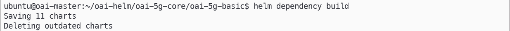

<details>
<summary>values.yaml</summary>

```yaml
# SPDX-License-Identifier: MIT

global:
  kubernetesDistribution: Vanilla
  coreNetworkConfigMap: oai-5g-basic
  clusterIpServiceIpAllocation: true
  waitForNRF: true
  waitForUDR: true
  http2Param: "--http2-prior-knowledge"
  timeout: 1
  imagePullSecrets:
  - &secret
    name: "regcred"

mysql:
  enabled: true
  imagePullPolicy: IfNotPresent
  oai5gdatabase: basic
  imagePullSecrets:
    - *secret
  persistence:
    enabled: false
  nodeSelector:
    kubernetes.io/hostname: oai-cp

oai-nrf:
  enabled: true
  nfimage:
    repository: docker.io/oaisoftwarealliance/oai-nrf
    version: v2.2.0
    pullPolicy: IfNotPresent
  includeTcpDumpContainer: false
  persistent:
    sharedvolume: false
    storageClass: "-"
    size: 1Gi
  start:
    nrf: true
    tcpdump: false
  imagePullSecrets:
    - *secret
  nodeSelector:
    kubernetes.io/hostname: oai-cp

oai-lmf:
  enabled: true
  nfimage:
    repository: docker.io/oaisoftwarealliance/oai-lmf
    version: v2.2.0
    pullPolicy: IfNotPresent
  includeTcpDumpContainer: false
  persistent:
    sharedvolume: false
  start:
    lmf: true
    tcpdump: false
  imagePullSecrets:
    - *secret
  nodeSelector:
    kubernetes.io/hostname: oai-cp

oai-udr:
  enabled: true
  nfimage:
    repository: docker.io/oaisoftwarealliance/oai-udr
    version: v2.2.0
    pullPolicy: IfNotPresent
  includeTcpDumpContainer: false
  persistent:
    sharedvolume: false
  start:
    udr: true
    tcpdump: false
  imagePullSecrets:
    - *secret
  nodeSelector:
    kubernetes.io/hostname: oai-cp

oai-udm:
  enabled: true
  nfimage:
    repository: docker.io/oaisoftwarealliance/oai-udm
    version: v2.2.0
    pullPolicy: IfNotPresent
  includeTcpDumpContainer: false
  persistent:
    sharedvolume: false
  start:
    udm: true
    tcpdump: false
  imagePullSecrets:
    - *secret
  nodeSelector:
    kubernetes.io/hostname: oai-cp

oai-ausf:
  enabled: true
  nfimage:
    repository: docker.io/oaisoftwarealliance/oai-ausf
    version: v2.2.0
    pullPolicy: IfNotPresent
  includeTcpDumpContainer: false
  persistent:
    sharedvolume: false
  start:
    ausf: true
    tcpdump: false
  imagePullSecrets:
    - *secret
  nodeSelector:
    kubernetes.io/hostname: oai-cp

oai-amf:
  enabled: true
  nfimage:
    repository: docker.io/oaisoftwarealliance/oai-amf
    version: v2.2.0
    pullPolicy: IfNotPresent
  includeTcpDumpContainer: false
  persistent:
    sharedvolume: false
  start:
    amf: true
    tcpdump: false
  imagePullSecrets:
    - *secret
  nodeSelector:
    kubernetes.io/hostname: oai-cp
  multus:
    enabled: true
    interfaces:
      - name: "n2"
        type: ipvlan
        mode: l2
        hostInterface: "ens8"
        ipAdd: "10.100.50.249"
        netmask: "29"
        routes: ""
        enabled: true
      - name: "sbi"
        hostInterface: "eth0"
        ipAdd: "172.21.8.91"
        netmask: "22"
        gateway: "172.21.11.254"
        enabled: false

oai-upf:
  enabled: true
  nfimage:
    repository: docker.io/oaisoftwarealliance/oai-upf
    version: v2.2.0
    pullPolicy: IfNotPresent
  includeTcpDumpContainer: false
  persistent:
    sharedvolume: false
  start:
    upf: true
    tcpdump: false
  imagePullSecrets:
    - *secret
  nodeSelector:
    kubernetes.io/hostname: oai-up
  multus:
    enabled: true
    interfaces:
      - name: "n3"
        type: ipvlan
        mode: l2
        hostInterface: "ens8"
        ipAdd: "10.100.50.233"
        netmask: "29"
        enabled: true
      - name: "n4"
        type: ipvlan
        mode: l2
        hostInterface: "ens8"
        ipAdd: "10.100.50.241"
        netmask: "29"
        enabled: true
      - name: "n6"
        type: ipvlan
        mode: l2
        hostInterface: "ens3"
        ipAdd: "10.10.10.105"
        netmask: "16"
        enabled: true
      - name: "n9"
        hostInterface: "eth0"
        ipAdd: "192.168.23.2"
        netmask: "24"
        enabled: false
      - name: "sbi"
        hostInterface: "eth0"
        ipAdd: "172.21.8.91"
        netmask: "22"
        gateway: "172.21.11.254"
        enabled: false

oai-traffic-server:
  enabled: false
  nfimage:
    repository: docker.io/oaisoftwarealliance/trf-gen-cn5g
    version: latest
    pullPolicy: IfNotPresent
  imagePullSecrets:
    - *secret
  multus:
    enabled: false
    interfaces:
      - name: "external"
        hostInterface: "eth0"
        ipAdd: "172.21.6.99"
        netmask: "22"
        defaultRoute: "172.21.7.254"
        enabled: true
  config:
    ueroute: 12.1.1.0/24
    upfHost: oai-upf
    noOfIperf3Server: 2
  resources:
    define: false
    limits:
      cpu: 100m
      memory: 128Mi
    requests:
      cpu: 100m
      memory: 128Mi
  nodeSelector: {}
  nodeName: ""

oai-smf:
  enabled: true
  nfimage:
    repository: docker.io/oaisoftwarealliance/oai-smf
    version: v2.2.0
    pullPolicy: IfNotPresent
  includeTcpDumpContainer: false
  persistent:
    sharedvolume: false
  config:
    imsHost: ims
  start:
    smf: true
    tcpdump: false
  imagePullSecrets:
    - *secret
  nodeSelector:
    kubernetes.io/hostname: oai-cp
  multus:
    enabled: true
    interfaces:
      - name: "smfn4"
        type: ipvlan
        mode: l2
        hostInterface: "ens8"
        ipAdd: "10.100.50.244"
        netmask: "29"
        enabled: true
      - name: "sbi"
        hostInterface: "eth0"
        ipAdd: "172.21.8.92"
        netmask: "22"
        gateway: "172.21.11.254"
        enabled: false

ims:
  enabled: true
  imagePullSecrets:
    - *secret
  imsUsers:
    - id: "001010000000100"
      fullname: tom
      hassip: yes
      context: users
      host: dynamic
      transport: tcp,udp
    - id: "001010000000101"
      fullname: harry
      hassip: yes
      context: users
      host: dynamic
      transport: tcp,udp
```

</details>

<details>
<summary>config.yaml</summary>

```yaml
# SPDX-License-Identifier: LicenseRef-CSSL-1.0

############# Common configuration

log_level:
  general: debug

register_nf:
  general: yes

http_version: 2
curl_timeout: 6000

snssais:
  - &embb_slice1
    sst: 1
  - &embb_slice2
    sst: 1
    sd: FFFFFF

nfs:
  amf:
    host: oai-amf
    sbi:
      port: 80
      api_version: v1
      interface_name: eth0
    n2:
      interface_name: n2
      port: 38412
  smf:
    host: oai-smf
    sbi:
      port: 80
      api_version: v1
      interface_name: eth0
    n4:
      interface_name: smfn4
      port: 8805
  upf:
    host: oai-upf
    sbi:
      port: 80
      api_version: v1
      interface_name: eth0
    n3:
      interface_name: n3
      port: 2152
    n4:
      interface_name: n4
      port: 8805
    n6:
      interface_name: n6
    n9:
      interface_name: eth0
      port: 2152
  udm:
    host: oai-udm
    sbi:
      port: 80
      api_version: v1
      interface_name: eth0
  udr:
    host: oai-udr
    sbi:
      port: 80
      api_version: v1
      interface_name: eth0
  lmf:
    host: oai-lmf
    sbi:
      port: 80
      api_version: v1
      interface_name: eth0
  ausf:
    host: oai-ausf
    sbi:
      port: 80
      api_version: v1
      interface_name: eth0
  nrf:
    host: oai-nrf
    sbi:
      port: 80
      api_version: v1
      interface_name: eth0

database:
  host: mysql
  user: test
  type: mysql
  password: test
  database_name: oai_db
  generate_random: true
  connection_timeout: 300

amf:
  amf_name: "OAI-AMF"
  support_features_options:
    enable_simple_scenario: no
    enable_nssf: no
    enable_smf_selection: yes
  relative_capacity: 30
  statistics_timer_interval: 20
  emergency_support: false
  served_guami_list:
    - mcc: 001
      mnc: 01
      amf_region_id: 01
      amf_set_id: 001
      amf_pointer: 01
  plmn_support_list:
    - mcc: 001
      mnc: 01
      tac: 0x0001
      nssai:
        - *embb_slice1
        - *embb_slice2
  supported_integrity_algorithms:
    - "NIA1"
    - "NIA2"
  supported_encryption_algorithms:
    - "NEA0"
    - "NEA1"
    - "NEA2"

smf:
  ue_mtu: 1500
  support_features:
    use_local_subscription_info: no
    use_local_pcc_rules: yes
  upfs:
    - host: 10.100.50.241
      config:
        enable_usage_reporting: no
  ue_dns:
    primary_ipv4: "1.1.1.1"
    primary_ipv6: "2001:4860:4860::8888"
    secondary_ipv4: "8.8.8.8"
    secondary_ipv6: "2001:4860:4860::8888"
  ims:
    pcscf_ipv4: "192.168.70.139"
    pcscf_ipv6: "fe80::7915:f408:1787:db8b"
  smf_info:
    sNssaiSmfInfoList:
      - sNssai: *embb_slice1
        dnnSmfInfoList:
          - dnn: "oai"
      - sNssai: *embb_slice2
        dnnSmfInfoList:
          - dnn: "ims"
  local_subscription_infos:
    - single_nssai: *embb_slice1
      dnn: "oai"
      qos_profile:
        5qi: 9
        session_ambr_ul: "200Mbps"
        session_ambr_dl: "400Mbps"
    - single_nssai: *embb_slice2
      dnn: "ims"
      qos_profile:
        5qi: 2
        session_ambr_ul: "100Mbps"
        session_ambr_dl: "200Mbps"

lmf:
  http_threads_count: 8
  gnb_id_bits_count: 28
  num_gnb: 1
  trp_info_wait_ms: 10000
  positioning_wait_ms: 10000
  measurement_wait_ms: 10000
  support_features:
    request_trp_info: no
    determine_num_gnb: yes
    use_http2: yes
    use_fqdn_dns: no
    register_nrf: yes

upf:
  support_features:
    enable_bpf_datapath: no
    enable_snat: yes
  remote_n6_gw: 10.10.0.1
  upf_info:
    sNssaiUpfInfoList:
      - sNssai: *embb_slice1
        dnnUpfInfoList:
          - dnn: oai
      - sNssai: *embb_slice2
        dnnUpfInfoList:
          - dnn: ims

dnns:
  - dnn: "oai"
    pdu_session_type: "IPV4"
    ipv4_subnet: "12.1.1.0/24"
  - dnn: "ims"
    pdu_session_type: "IPV4V6"
    ipv4_subnet: "14.1.1.0/24"
```

</details>

### (8) Deploy OAI 5G Core

```bash
# Run on: oai-master

cd ~/oai-helm/oai-5g-core/oai-5g-basic

helm install -n core oai-core ./

# Verify all Core pods are running and check AMF/SMF/UPF logs
kubectl get pods -n core

kubectl logs -n core <amf-pod-name>
kubectl logs -n core <smf-pod-name>
kubectl logs -n core <upf-pod-name>
```

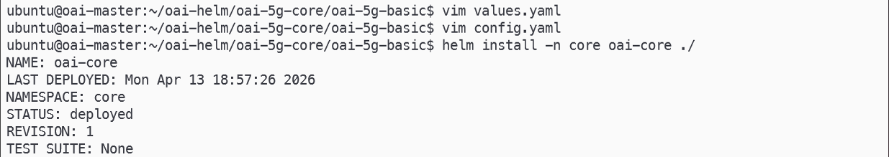

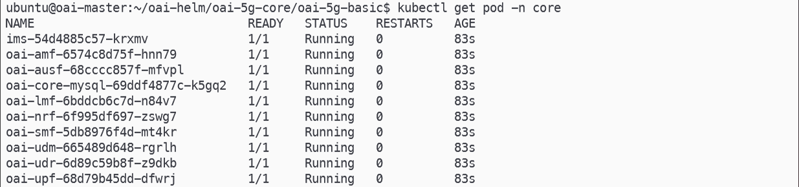

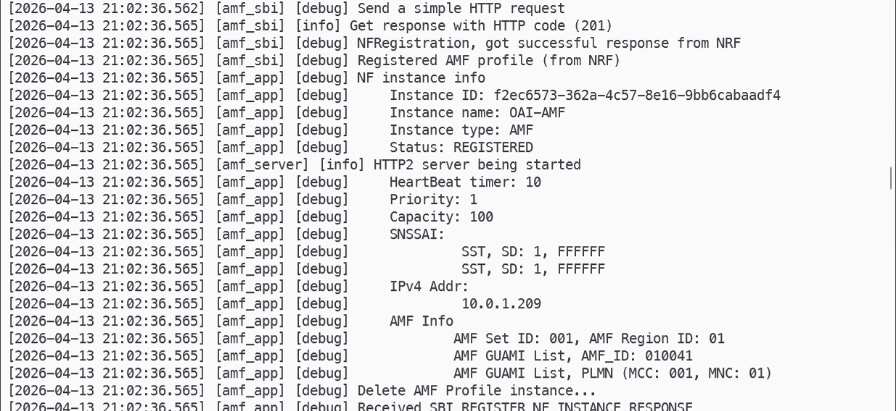

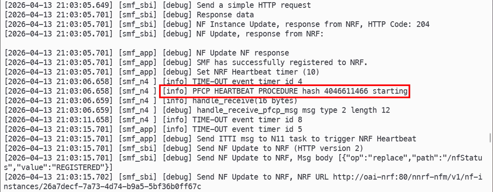

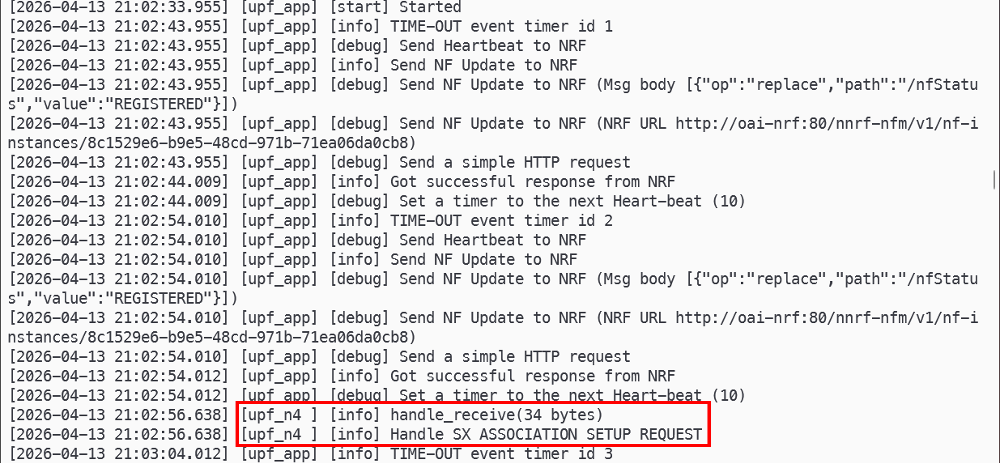

### (9) Configure UPF Routing Rules

Policy-based routing is required so that UE traffic egresses via the N6 interface rather than the default route.

```bash
# Run on: oai-master

# Open a shell inside the UPF pod
kubectl exec -it -n core <upf-pod-name> -- bash

# Inside the UPF pod:
echo "100 n6rt" >> /etc/iproute2/rt_tables

ip route add default via 10.10.0.1 dev n6 table n6rt
ip rule add from 12.1.1.0/24 lookup n6rt priority 100
ip rule add from 14.1.1.0/24 lookup n6rt priority 100
```

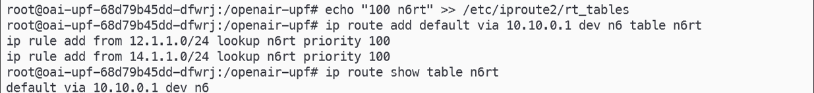

### (10) Deploy gNB

```bash
# Run on: oai-master

cd ~/oai-helm/oai-5g-ran/oai-gnb

# Add ipvlan NAD template (same procedure as Step 6)
vim templates/nad.yaml

# Configure nodeSelector, Multus interfaces (IP, interface name, enabled flag)
# Set amfHost to the AMF N2 interface IP
vim values.yaml

# Set PLMN (mcc, mnc), AMF IP address, and gNB N2/N3 interface IPs
vim config.yaml

# Deploy gNB
helm install -n an oai-gnb ./

# Verify gNB pod is running
kubectl get pods -n an
```

<details>
<summary>gnb values.yaml</summary>

```yaml
# SPDX-License-Identifier: MIT

kubernetesDistribution: Vanilla

nfimage:
  repository: docker.io/oaisoftwarealliance/oai-gnb
  version: develop
  pullPolicy: IfNotPresent

imagePullSecrets:
  - name: "regcred"

serviceAccount:
  create: true
  annotations: {}

multus:
  enabled: true
  interfaces:
    - name: "n2"
      hostInterface: "ens8"
      ipAdd: "10.100.50.250"
      netmask: "29"
      enabled: true
      type: ipvlan
      mode: "l2"
    - name: "n3"
      hostInterface: "ens8"
      ipAdd: "10.100.50.234"
      netmask: "29"
      enabled: true
      type: ipvlan
      mode: "l2"
    - name: "e2"
      hostInterface: "eth0"
      ipAdd: "192.168.85.94"
      enabled: false
      netmask: "24"
      type: macvlan
      mode: "bridge"
    - name: "ru"
      hostInterface: "eth0"
      ipAdd: "192.168.80.90"
      netmask: "24"
      gateway: "192.168.80.1"
      enabled: false
      mtu: 1500
      type: vlan
      vlan: 100

config:
  timeZone: "Europe/Paris"
  useAdditionalOptions: "-E --rfsim --log_config.global_log_options level,nocolor,time"
  gnbName: "oai-gnb"
  gdbstack: 1
  radio: "rfsim"
  enableE2: false
  ricHost: "oai-flexric"
  amfHost: "10.100.50.249"
  tac: 1
  plmn_list:
    - mcc: 001
      mnc: 01
      mnc_length: 2
      snssaiList:
        - sst: "1"
          sd: "0xffffff"

start:
  gnb: true
  tcpdump: false

includeTcpDumpContainer: false

podSecurityContext:
  runAsUser: 0
  runAsGroup: 0

securityContext:
  privileged: false
  capabilities:
    add:
      - SYS_NICE
      - IPC_LOCK
    drop:
      - ALL

tcpdumpimage:
  repository: docker.io/oaisoftwarealliance/oai-tcpdump-init
  version: alpine-3.20
  pullPolicy: IfNotPresent

resources:
  define: false
  limits:
    nf:
      cpu: 2000m
      memory: 2Gi
    tcpdump:
      cpu: 200m
      memory: 128Mi
  requests:
    nf:
      cpu: 2000m
      memory: 2Gi
    tcpdump:
      cpu: 100m
      memory: 128Mi

terminationGracePeriodSeconds: 5
nodeSelector: {}
nodeName: oai-an
```

</details>

<details>
<summary>gnb config.yaml</summary>

```yaml
Active_gNBs:
  - gnb-rfsim
Asn1_verbosity: none
gNBs:
  - gNB_ID: 0xe00
    gNB_name: gnb-rfsim
    tracking_area_code: 1
    plmn_list:
      - mcc: 001
        mnc: 01
        mnc_length: 2
        snssaiList:
          - sst: 1
            sd: 0xFFFFFF
    nr_cellid: 12345678
    min_rxtxtime: 6
    servingCellConfigCommon:
      - physCellId: 0
        absoluteFrequencySSB: 621312
        dl_absoluteFrequencyPointA: 620040
        dl_offstToCarrier: 0
        dl_subcarrierSpacing: 1
        dl_carrierBandwidth: 106
        initialDLBWPlocationAndBandwidth: 28875
        initialDLBWPsubcarrierSpacing: 1
        initialDLBWPcontrolResourceSetZero: 11
        initialDLBWPsearchSpaceZero: 0
        ul_frequencyBand: 78
        ul_offstToCarrier: 0
        ul_subcarrierSpacing: 1
        ul_carrierBandwidth: 106
        pMax: 20
        initialULBWPlocationAndBandwidth: 28875
        initialULBWPsubcarrierSpacing: 1
        prach_ConfigurationIndex: 98
        prach_msg1_FDM: 0
        prach_msg1_FrequencyStart: 0
        zeroCorrelationZoneConfig: 12
        preambleReceivedTargetPower: -104
        preambleTransMax: 6
        powerRampingStep: 1
        ssb_perRACH_OccasionAndCB_PreamblesPerSSB_PR: 4
        ssb_perRACH_OccasionAndCB_PreamblesPerSSB: 15
        ra_ContentionResolutionTimer: 7
        rsrp_ThresholdSSB: 19
        prach_RootSequenceIndex_PR: 2
        prach_RootSequenceIndex: 1
        msg1_SubcarrierSpacing: 1
        restrictedSetConfig: 0
        msg3_DeltaPreamble: 1
        p0_NominalWithGrant: -90
        pucchGroupHopping: 0
        hoppingId: 40
        p0_nominal: -90
        ssb_PositionsInBurst_Bitmap: 1
        ssb_periodicityServingCell: 2
        dmrs_TypeA_Position: 0
        subcarrierSpacing: 1
        referenceSubcarrierSpacing: 1
        dl_UL_TransmissionPeriodicity: 6
        nrofDownlinkSlots: 7
        nrofDownlinkSymbols: 6
        nrofUplinkSlots: 2
        nrofUplinkSymbols: 4
        ssPBCH_BlockPower: -25
    SCTP:
      SCTP_INSTREAMS: 2
      SCTP_OUTSTREAMS: 2
    amf_ip_address:
      - ipv4: 10.100.50.249     # AMF N2 IP
    NETWORK_INTERFACES:
      GNB_IPV4_ADDRESS_FOR_NG_AMF: 10.100.50.250   # gNB N2 IP
      GNB_IPV4_ADDRESS_FOR_NGU: 10.100.50.234      # gNB N3 IP
      GNB_PORT_FOR_S1U: 2152
MACRLCs:
  - num_cc: 1
    tr_s_preference: local_L1
    tr_n_preference: local_RRC
    pusch_TargetSNRx10: 200
    pucch_TargetSNRx10: 200
L1s:
  - num_cc: 1
    tr_n_preference: local_mac
    prach_dtx_threshold: 200
RUs:
  - local_rf: yes
    nb_tx: 1
    nb_rx: 1
    att_tx: 0
    att_rx: 0
    bands: [78]
    max_pdschReferenceSignalPower: -27
    max_rxgain: 75
    eNB_instances: [0]
    sf_extension: 0
    sdr_addrs: serial=XXXXXXX
rfsimulator:
  - serveraddr: server
security:
  ciphering_algorithms: [nea0]
  integrity_algorithms: [nia2, nia0]
  drb_ciphering: yes
  drb_integrity: no
log_config:
  global_log_level: info
  hw_log_level: info
  phy_log_level: info
  mac_log_level: info
  rlc_log_level: info
  pdcp_log_level: info
  rrc_log_level: info
  ngap_log_level: debug
  f1ap_log_level: debug
```

</details>

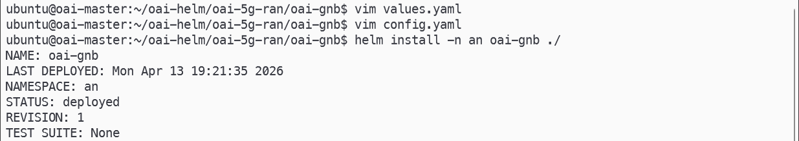

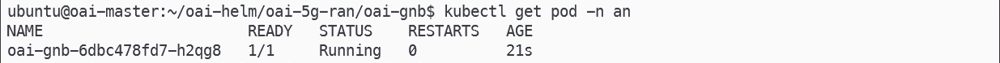

### (11) Deploy NR-UE

```bash
# Run on: oai-master

cd ~/oai-helm/oai-5g-ran/oai-nr-ue

helm install -n an oai-ue ./

# Verify UE pod is running and check logs
kubectl get pods -n an
kubectl logs -n an <ue-pod-name>
```

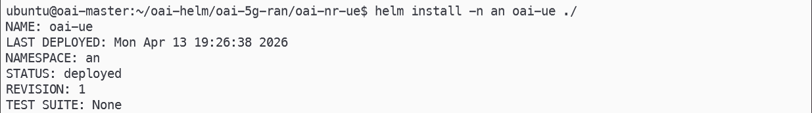

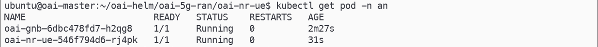

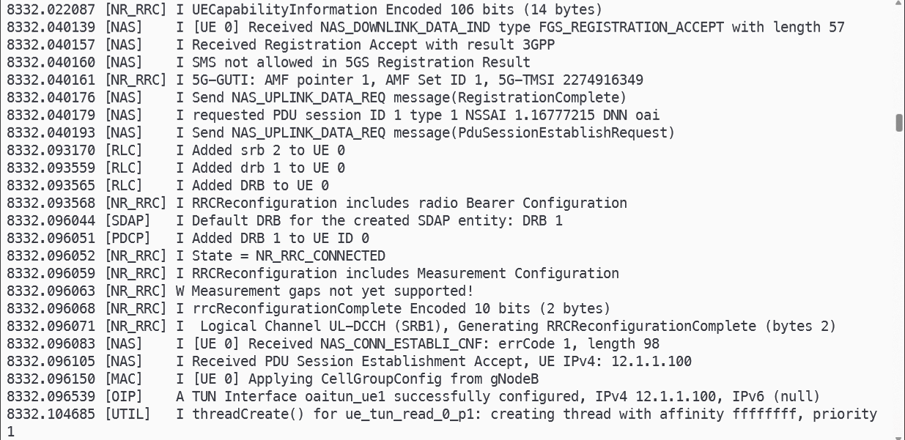

### (12) Verify End-to-End Connectivity

```bash
# Run on: oai-master

# Open a shell inside the UE pod
kubectl exec -it -n an <ue-pod-name> -- bash

# Inside the UE pod:
ip a

# Ping through the UE tunnel interface to verify data plane connectivity
ping -c 3 -I oaitun_ue1 8.8.8.8
```

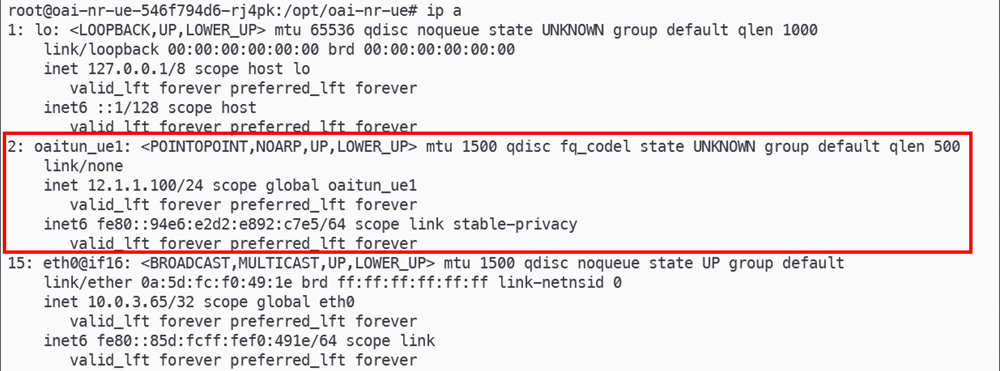

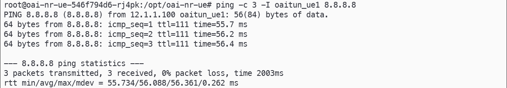

---

## 3. Troubleshooting

### MySQL Fails to Start — CPU Does Not Support AVX2

MySQL 8.x requires AVX2 CPU instructions. If your VM does not support AVX2, downgrade to MySQL 5.7 by overriding the image tag in `values.yaml`.

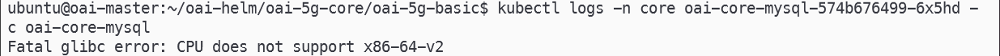

```bash
# Check AVX2 support
lscpu | grep avx2

# If AVX2 is not listed, add the following under the mysql scope in values.yaml
cd ~/oai-helm/oai-5g-core/oai-5g-basic
vim values.yaml
```

```yaml
# Add under the mysql section in values.yaml
mysql:
  ...
  imageTag: "5.7"
```

```bash
# Redeploy the Core (Step 8)
```

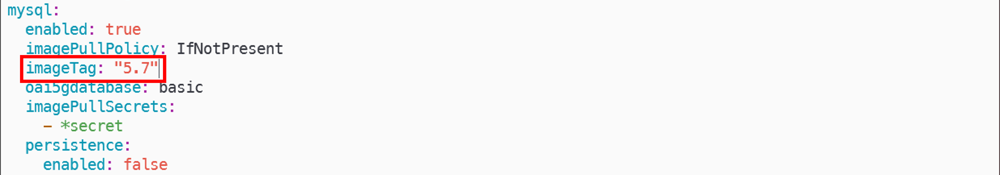

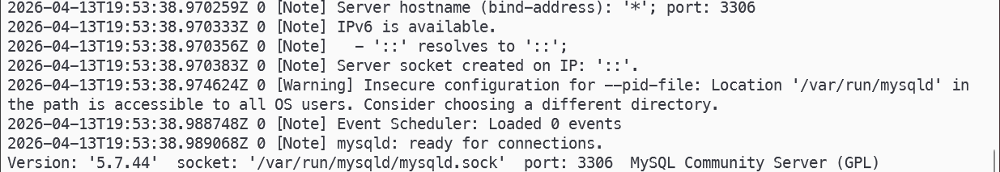

### OAI RAN Fails to Start — CPU Does Not Support AVX2

OAI RAN images require AVX2. If your VM does not support it, use UERANSIM as a drop-in replacement for the gNB and UE.

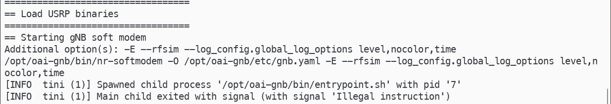

```bash
# Change AMF image from v2.2.0 to develop to resolve NGAP compatibility issues with UERANSIM
cd ~/oai-helm/oai-5g-core/oai-5g-basic
vim values.yaml
# Set oai-amf.nfimage.version: develop

# Clone UERANSIM helm charts from free5gc-helm
cd ~
git clone https://github.com/free5gc/free5gc-helm.git
cd ~/free5gc-helm/charts/ueransim

# Configure Multus interfaces, PLMN, and nodeSelector to match the OAI core deployment
vim values.yaml

helm install -n an ueransim ./
```

<details>
<summary>ueransim values.yaml</summary>

```yaml
# SPDX-License-Identifier: MIT

global:
  n2network:
    enabled: true
    name: n2network
    type: ipvlan
    mode: l2
    masterIf: ens8
    subnetIP: 10.100.50.248
    cidr: 29
    gatewayIP: ""
  n3network:
    enabled: true
    name: n3network
    type: ipvlan
    mode: l2
    masterIf: ens8
    subnetIP: 10.100.50.232
    cidr: 29
    gatewayIP: ""

projectName: ueransim

initcontainers:
  sctp_test:
    image: towards5gs/sctp_test
    tag: latest

gnb:
  enabled: true
  name: gnb
  replicaCount: 1
  image:
    name: free5gc/ueransim
    tag: v4.0.1
    pullPolicy: IfNotPresent
  configmap:
    name: gnb-configmap
  volume:
    name: gnb-volume
    mount: /ueransim/config
  service:
    name: gnb-service
    type: ClusterIP
    port: 4997
    protocol: UDP
  n2if:
    ipAddress: 10.100.50.250
  n3if:
    ipAddress: 10.100.50.234
  amf:
    n2if:
      ipAddress: 10.100.50.249
      port: 38412
    service:
      ngap:
        enabled: false
  podAnnotations: {}
  imagePullSecrets: []
  podSecurityContext: {}
  resources:
    requests:
      cpu: 100m
      memory: 256Mi
  nodeSelector:
    kubernetes.io/hostname: oai-an
  tolerations: []
  affinity: {}
  configuration: |-
    mcc: '001'
    mnc: '01'
    nci: '0x000000010'
    idLength: 32
    tac: 1
    slices:
      - sst: 0x1
        sd: 0xFFFFFF
    ignoreStreamIds: true

ue:
  enabled: true
  name: ue
  replicaCount: 1
  image:
    name: free5gc/ueransim
    tag: v4.0.1
    pullPolicy: IfNotPresent
  configmap:
    name: ue-configmap
  volume:
    name: ue-volume
    mount: /ueransim/config
  command: "./nr-ue -c ./config/ue-config.yaml"
  script: ""
  podAnnotations: {}
  imagePullSecrets: []
  podSecurityContext: {}
  securityContext:
    capabilities:
      add: ["NET_ADMIN"]
  resources:
    requests:
      cpu: 100m
      memory: 128Mi
  nodeSelector:
    kubernetes.io/hostname: oai-an
  tolerations: []
  affinity: {}
  configuration: |-
    supi: "imsi-001010000000100"
    mcc: "001"
    mnc: "01"
    key: "fec86ba6eb707ed08905757b1bb44b8f"
    op: "C42449363BBAD02B66D16BC975D77CC1"
    opType: "OPC"
    amf: "8000"
    imei: "356938035643803"
    imeiSv: "4370816125816151"
    uacAic:
      mps: false
      mcs: false
    uacAcc:
      normalClass: 0
      class11: false
      class12: false
      class13: false
      class14: false
      class15: false
    sessions:
      - type: "IPv4"
        apn: "oai"
        slice:
          sst: 0x01
          sd: 0xFFFFFF
    configured-nssai:
      - sst: 0x01
        sd: 0xFFFFFF
    default-nssai:
      - sst: 1
        sd: 0xFFFFFF
    integrity:
      IA1: true
      IA2: true
      IA3: true
    ciphering:
      EA1: true
      EA2: true
      EA3: true
    integrityMaxRate:
      uplink: "full"
      downlink: "full"
```

</details>
