# Free5GC Deployment (Single Cluster - Multi Node)

## 1. Prerequisites

Deploy Free5GC on a single Kubernetes cluster across multiple nodes.

- **OS:** Ubuntu 22.04.5 LTS

| Hostname | vCPU | RAM | HDD |
|---|---|---|---|
| free5gc-master | 4 vCPU | 8 GB | 40 GB |
| free5gc-cp (Control Plane) | 4 vCPU | 8 GB | 40 GB |
| free5gc-up (User Plane) | 4 vCPU | 8 GB | 40 GB |
| free5gc-an (Access Network) | 4 vCPU | 8 GB | 40 GB |

| Node | Deploy | NIC1(ens3) | NIC2(ens8) |
|---|---|---|---|
| free5gc-master | Kubernetes master node | Assigned IP | — |
| free5gc-cp | Control Plane NFs | Assigned IP | 10.100.50.11 |
| free5gc-up | UPF | Assigned IP | 10.100.50.21 |
| free5gc-an | gNB and UE | Assigned IP | 10.100.50.31 |

| Network Interface | CNI and Multus Interface | IP Pool |
|---|---|---|
| NIC1(ens3) | Cilium, N6 | NIC1 IP Pool(In this case 10.10.10.0/16) |
| NIC2(ens8) | N2, N3, N4 | 10.100.50.0/24 |

---

## 2. Installation

### (1) Install gtp5g on the UP Node

```bash
# Run on: free5gc-up

# Download and extract gtp5g
wget https://github.com/free5gc/gtp5g/archive/refs/tags/v0.9.14.tar.gz
tar xvfz v0.9.14.tar.gz
cd gtp5g-0.9.14/

# Install build dependencies
sudo apt-get install gcc make -y

# Compile and install gtp5g
sudo make
sudo make install

# Verify installation
gcc --version
lsmod | grep gtp
```

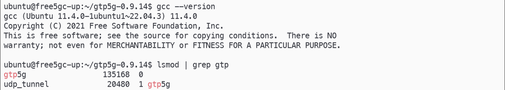

### (2) Install Container Runtime (containerd) on All Nodes

```bash
# Run on: ALL nodes

sudo apt-get update

# Install required packages
sudo apt-get install -y curl ca-certificates gnupg

# Add Docker GPG key and repository
sudo install -m 0755 -d /etc/apt/keyrings
curl -fsSL https://download.docker.com/linux/ubuntu/gpg | sudo gpg --dearmor -o /etc/apt/keyrings/docker.gpg
sudo chmod a+r /etc/apt/keyrings/docker.gpg

echo "deb [arch=$(dpkg --print-architecture) signed-by=/etc/apt/keyrings/docker.gpg] https://download.docker.com/linux/ubuntu $(. /etc/os-release && echo "$VERSION_CODENAME") stable" | sudo tee /etc/apt/sources.list.d/docker.list > /dev/null

sudo apt-get update

# Install containerd
sudo apt-get install -y containerd.io

# Configure containerd with SystemdCgroup enabled
sudo mkdir -p /etc/containerd
sudo containerd config default | sudo tee /etc/containerd/config.toml
sudo sed -i "s/SystemdCgroup = false/SystemdCgroup = true/g" /etc/containerd/config.toml
sudo systemctl restart containerd
```

### (3) Install Kubernetes on All Nodes

```bash
# Run on: ALL nodes

# Add Kubernetes repository (v1.29)
curl -fsSL https://pkgs.k8s.io/core:/stable:/v1.29/deb/Release.key | sudo gpg --dearmor -o /etc/apt/keyrings/kubernetes-apt-keyring.gpg

echo 'deb [signed-by=/etc/apt/keyrings/kubernetes-apt-keyring.gpg] https://pkgs.k8s.io/core:/stable:/v1.29/deb/ /' | sudo tee /etc/apt/sources.list.d/kubernetes.list

sudo apt-get update

# Enable IPv4 forwarding and disable swap (required for Kubernetes)
sudo sysctl -w net.ipv4.ip_forward=1
sudo swapoff -a

# Enable bridge netfilter
sudo modprobe br_netfilter
sudo bash -c 'echo 1 > /proc/sys/net/bridge/bridge-nf-call-iptables'

# Install Kubernetes components
sudo apt-get install -y kubelet kubeadm kubectl

# Prevent automatic updates
sudo apt-mark hold kubelet kubeadm kubectl

# Verify installation
kubeadm version
kubelet --version
kubectl version --client
```

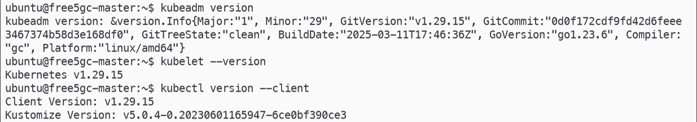

### (4) Initialize Kubernetes Cluster on Master Node

```bash
# Run on: free5gc-master

cd ~
vim config.yaml
```

```yaml
# config.yaml

apiVersion: kubeadm.k8s.io/v1beta3
kind: ClusterConfiguration
networking:
  podSubnet: "10.244.0.0/16"
  serviceSubnet: "10.96.0.0/16"
clusterName: "free5gc"
```

```bash
# Initialize the cluster
sudo kubeadm init --config=config.yaml --upload-certs | tee -a ~/k8s_init.log

# Configure kubectl access
mkdir -p $HOME/.kube
sudo cp -i /etc/kubernetes/admin.conf $HOME/.kube/config
sudo chown $USER:$USER $HOME/.kube/config
echo "export KUBECONFIG=$HOME/.kube/config" | tee -a ~/.bashrc
export KUBECONFIG=$HOME/.kube/config

# Note: Save the join command printed in k8s_init.log for worker nodes
```

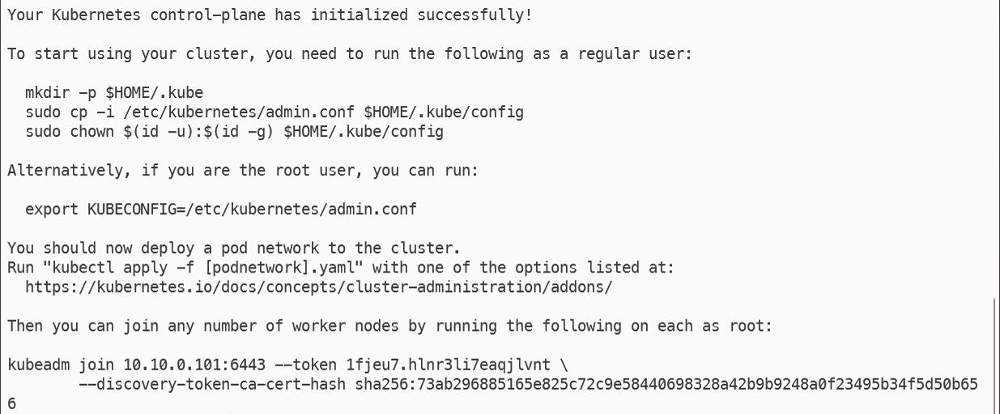

```bash
# Run on: free5gc-cp, free5gc-up, free5gc-an (Worker Nodes)

# Join each worker node to the cluster using the token from k8s_init.log
sudo kubeadm join <MASTER_NODE_IP>:<PORT> \
  --token <TOKEN> \
  --discovery-token-ca-cert-hash sha256:<HASH>
```

```bash
# Run on: free5gc-master
# Verify all nodes have joined successfully
kubectl get nodes -A
```

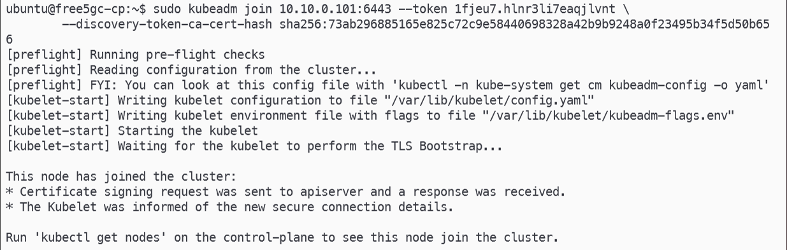

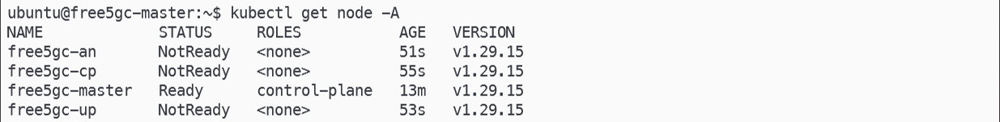

### (5) Deploy CNI (Cilium + Multus)

```bash
# Run on: free5gc-master

# Install Cilium CLI
curl -sL --remote-name https://github.com/cilium/cilium-cli/releases/latest/download/cilium-linux-amd64.tar.gz
tar xzf cilium-linux-amd64.tar.gz
sudo mv cilium /usr/local/bin/
rm cilium-linux-amd64.tar.gz

# Install Cilium with cni.exclusive=false to allow Multus to co-exist
cilium install \
  --set cni.exclusive=false

# Install Multus CNI
git clone https://github.com/k8snetworkplumbingwg/multus-cni.git && cd multus-cni
cat ./deployments/multus-daemonset.yml | kubectl apply -f -
cd ~

# Verify all pods are running
kubectl get pods -A
```

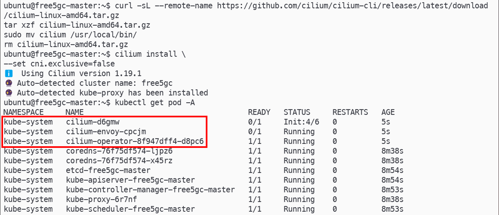

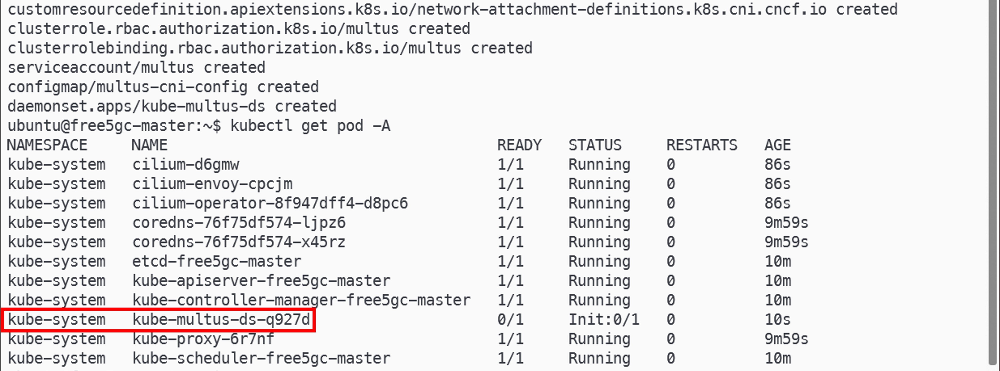

### (6) Create Namespaces and Install Helm

```bash
# Run on: free5gc-master

# Create namespaces for each plane
kubectl create ns cp && kubectl create ns up && kubectl create ns an

# Install Helm 3
curl -fsSL -o get_helm.sh https://raw.githubusercontent.com/helm/helm/main/scripts/get-helm-3
bash ./get_helm.sh
rm ./get_helm.sh

helm version
```

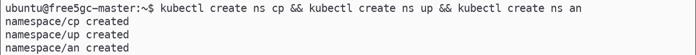

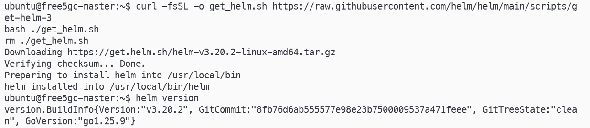

### (7) Create Persistent Volumes for MongoDB and NRF Certificates

```bash
# Run on: free5gc-master

cd ~

# Create PersistentVolume manifest for MongoDB
vim mongodb-pv.yaml

# Substitute placeholders with actual values
sed -i "s/\[USER\]/$USER/g" ~/mongodb-pv.yaml
sed -i "s/\[cp-node-name\]/free5gc-cp/g" ~/mongodb-pv.yaml
cat ~/mongodb-pv.yaml

# Apply MongoDB PV
kubectl apply -f mongodb-pv.yaml
kubectl get pv -A

# Create PersistentVolume manifest for NRF certificate
vim cert-pv.yaml

# Substitute placeholders
sed -i "s/\[USER\]/$USER/g" ~/cert-pv.yaml
sed -i "s/\[cp-node-name\]/free5gc-cp/g" ~/cert-pv.yaml
cat ~/cert-pv.yaml

# Apply certificate PV
kubectl apply -f cert-pv.yaml
kubectl get pv -A
```

```bash
# Run on: free5gc-cp
# Create required local directories for PV backing storage
mkdir -p ~/free5gc/mongodb/data-mongodb
mkdir -p ~/free5gc/cert
```

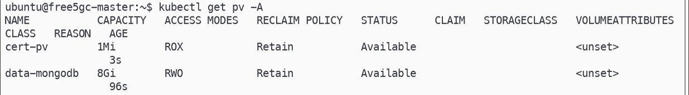

```yaml
# mongodb-pv.yaml

apiVersion: v1
kind: PersistentVolume
metadata:
  name: data-mongodb
  labels:
    project: free5gc
spec:
  capacity:
    storage: 8Gi
  accessModes:
    - ReadWriteOnce
  persistentVolumeReclaimPolicy: Retain
  local:
    path: /home/[USER]/free5gc/mongodb/data-mongodb   # Replace [USER]
  nodeAffinity:
    required:
      nodeSelectorTerms:
        - matchExpressions:
            - key: kubernetes.io/hostname
              operator: In
              values:
                - [cp-node-name]                       # Replace [cp-node-name]
```

```yaml
# cert-pv.yaml

apiVersion: v1
kind: PersistentVolume
metadata:
  name: cert-pv
  labels:
    project: free5gc
spec:
  capacity:
    storage: 1Mi
  accessModes:
    - ReadOnlyMany
  persistentVolumeReclaimPolicy: Retain
  local:
    path: /home/[USER]/free5gc/cert                   # Replace [USER]
  nodeAffinity:
    required:
      nodeSelectorTerms:
        - matchExpressions:
            - key: kubernetes.io/hostname
              operator: In
              values:
                - [cp-node-name]                       # Replace [cp-node-name]
```

### (8) Clone free5gc-helm and Configure Node Selectors

```bash
# Run on: free5gc-master

cd ~
git clone https://github.com/free5gc/free5gc-helm.git

cd ~/free5gc-helm/charts/free5gc/charts

# Pin all Control Plane NFs to free5gc-cp node
for f in free5gc-amf/values.yaml free5gc-ausf/values.yaml free5gc-dbpython/values.yaml \
          free5gc-n3iwf/values.yaml free5gc-nrf/values.yaml free5gc-nssf/values.yaml \
          free5gc-pcf/values.yaml free5gc-smf/values.yaml free5gc-udm/values.yaml \
          free5gc-udr/values.yaml free5gc-webui/values.yaml; do
  sed -i 's/nodeSelector: {}/nodeSelector:\n    kubernetes.io\/hostname: free5gc-cp/' "$f"
done

grep -A2 "nodeSelector" free5gc-amf/values.yaml

# Pin UPF to free5gc-up node
sed -i 's/nodeSelector: {}/nodeSelector:\n    kubernetes.io\/hostname: free5gc-up/' \
  free5gc-upf/values.yaml

grep -A2 "nodeSelector" free5gc-upf/values.yaml

# Pin gNB and UE (UERANSIM) to free5gc-an node
cd ~/free5gc-helm/charts/ueransim
sed -i 's/nodeSelector: {}/nodeSelector:\n  kubernetes.io\/hostname: free5gc-an/' \
  values.yaml

grep -A2 "nodeSelector" values.yaml
```

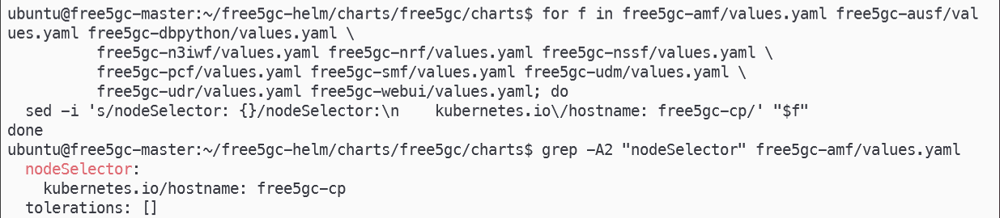

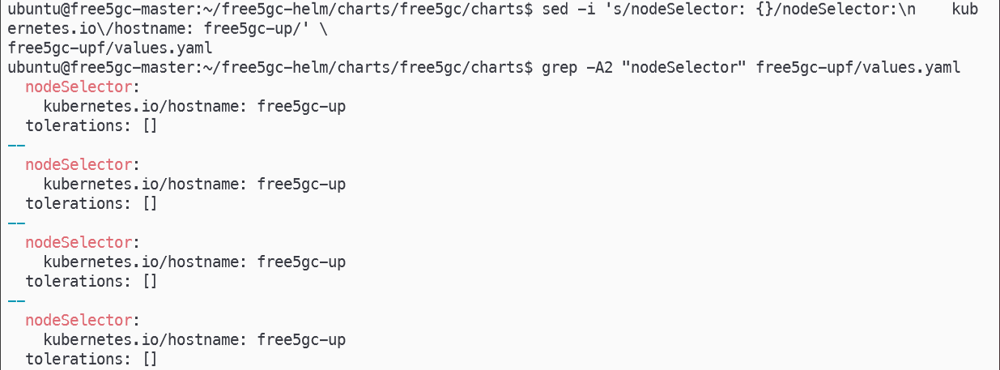

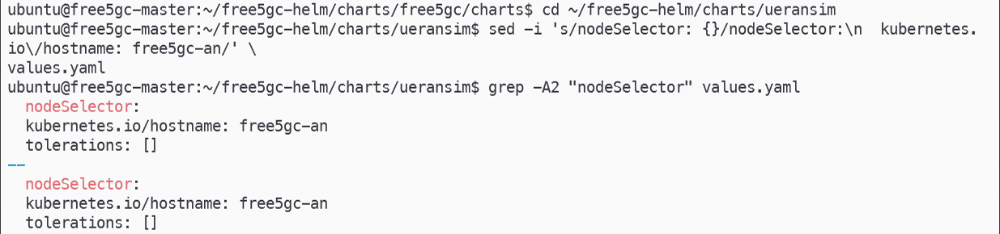

### (9) Deploy UPF

```bash
# Run on: free5gc-master

cd ~/free5gc-helm/charts/free5gc/charts

helm install userplane -n up \
  --set global.n3network.masterIf=ens8 \
  --set global.n4network.masterIf=ens8 \
  --set global.n9network.masterIf=ens8 \
  --set global.n6network.masterIf=ens3 \
  --set global.n6network.subnetIP="10.10.0.0" \
  --set global.n6network.cidr=16 \
  --set global.n6network.gatewayIP="10.10.0.1" \
  --set iupf1.n6if.ipAddress="10.10.10.105" \
  --set psaupf1.n6if.ipAddress="10.10.10.106" \
  --set psaupf2.n6if.ipAddress="10.10.10.107" \
  free5gc-upf

# Verify UPF pods are running and check logs
kubectl get pods -n up
kubectl logs -n up <iupf1-pod-name>
```

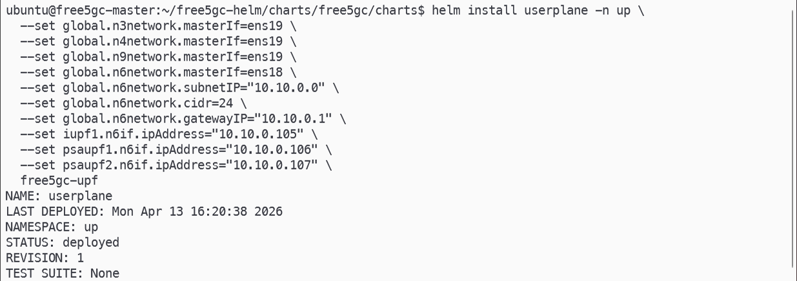

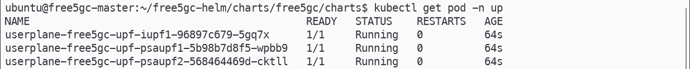

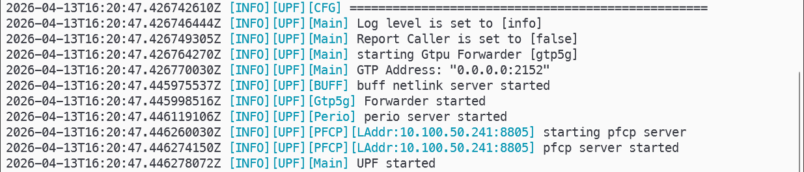

### (10) Deploy Control Plane NFs

```bash
# Run on: free5gc-master

cd ~/free5gc-helm/charts/free5gc

# Disable UPF and dbpython sub-charts (already deployed separately)
sed -i 's/deployUpf: true/deployUpf: false/' values.yaml
sed -i 's/deployDbPython: true/deployDbPython: false/' values.yaml

helm install controlplane -n cp \
  --set global.n2network.masterIf=ens8 \
  --set global.n3network.masterIf=ens8 \
  --set global.n4network.masterIf=ens8 \
  .

# Verify all Control Plane pods are running and check AMF/SMF logs
kubectl get pods -n cp
kubectl logs -n cp <amf-pod-name>
kubectl logs -n cp <smf-pod-name>
```

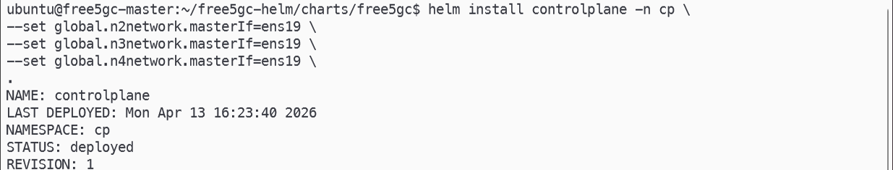

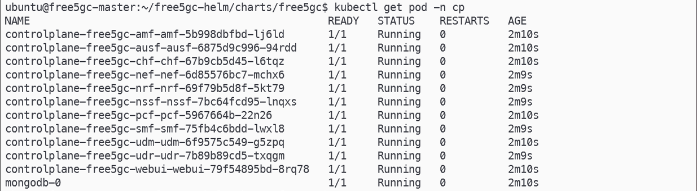

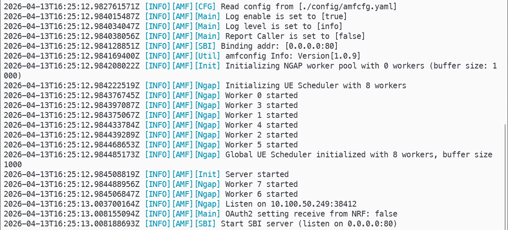

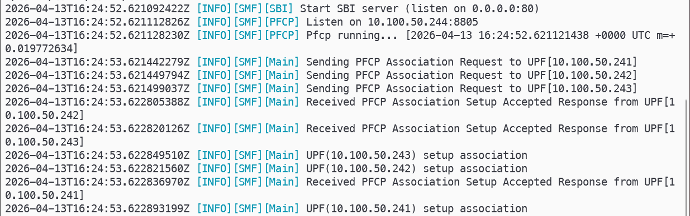

### (11) Register a New Subscriber via WebUI

Open the Free5GC WebUI in a browser:

```
http://<free5gc-cp-node-ip>:30500
```

- **Credentials:** `admin` / `free5gc`
- Navigate to **Subscribers** and register a new subscriber with the IMSI and credentials matching your UERANSIM UE configuration.

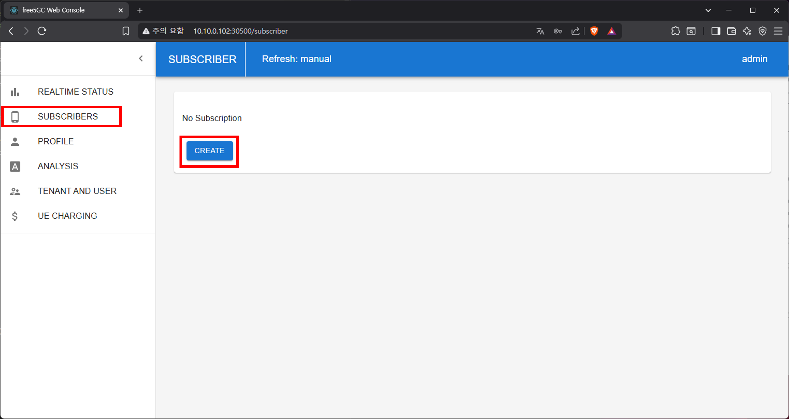

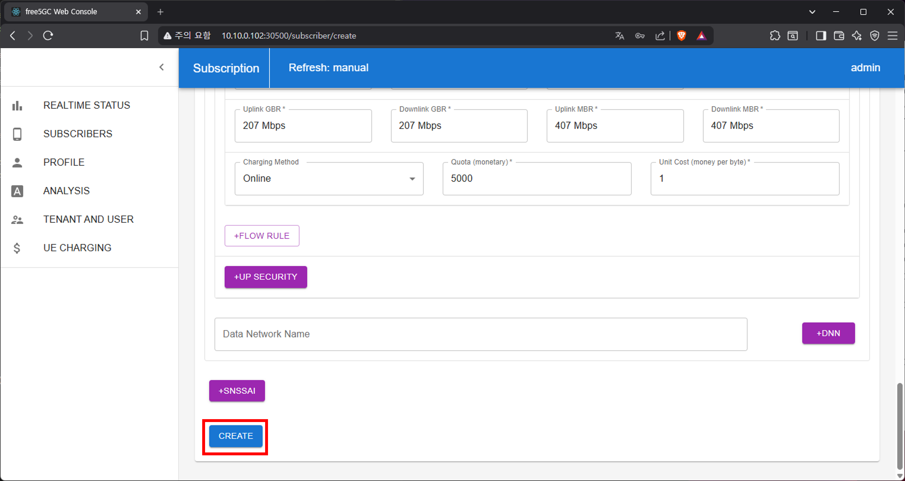

### (12) Deploy UERANSIM (gNB + UE)

```bash
# Run on: free5gc-master

cd ~/free5gc-helm/charts/ueransim

helm install ueransim -n an \
  --set global.n2network.masterIf=ens8 \
  --set global.n3network.masterIf=ens8 \
  .

# Verify pods are running and check UE logs
kubectl get pods -n an
kubectl logs -n an <ue-pod-name>
```

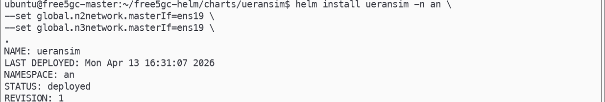

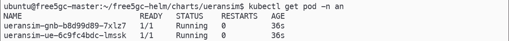

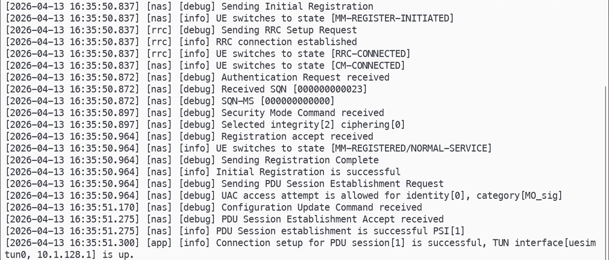

### (13) Verify End-to-End Connectivity

```bash
# Run on: free5gc-master

# Open a shell inside the UE pod
kubectl exec -it -n an <ue-pod-name> -- bash

# Inside the UE pod:
ip a

# Ping through the UE tunnel interface to verify data plane connectivity
ping -I uesimtun0 8.8.8.8
```

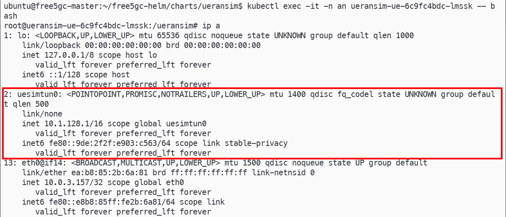

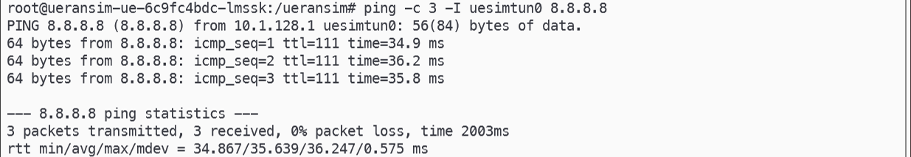

---

## 3. Troubleshooting

### MongoDB Fails to Start — CPU Does Not Support AVX2

MongoDB 5.x and later require AVX2 CPU instructions. If your VM does not support AVX2, downgrade the MongoDB chart to use MongoDB 4.4.

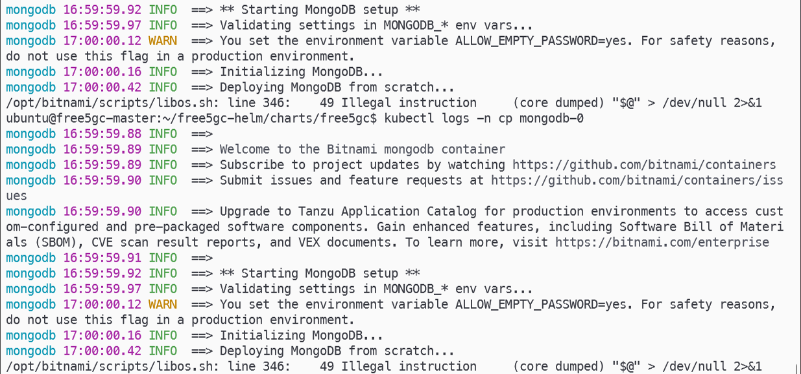

```bash
# Check AVX2 support
lscpu | grep avx2

# If AVX2 is not listed, proceed with the downgrade below
cd ~/free5gc-helm/charts/free5gc/charts

# Remove the bundled MongoDB chart
rm -rf mongodb mongodb-15.6.0.tgz

# Pull an older MongoDB chart compatible with MongoDB 4.4
helm repo add bitnami https://charts.bitnami.com/bitnami
helm repo update
helm pull bitnami/mongodb --version 13.6.0

tar -xzf mongodb-13.6.0.tgz

# Switch to the legacy image repository and pin to MongoDB 4.4
sed -i 's|repository: bitnami/mongodb|repository: bitnamilegacy/mongodb|' mongodb/values.yaml
sed -i 's|tag: 6.0.3-debian-11-r0|tag: 4.4.15|' mongodb/values.yaml

# Redeploy the Control Plane (Step 10)
```

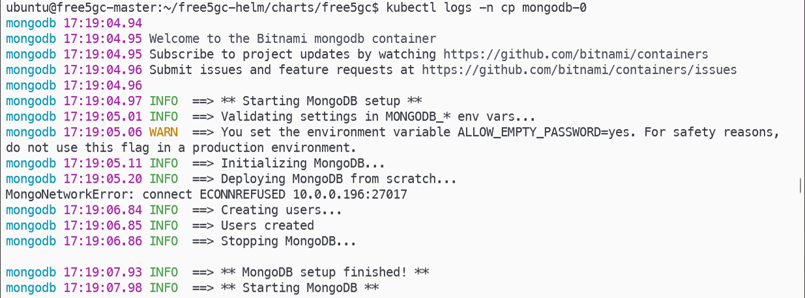

### cert-pv Stuck in Pending State After Redeployment

If `cert-pv` remains in `Pending` after redeploying, the PV may still hold a stale `claimRef` from a previous PVC. Remove it manually:

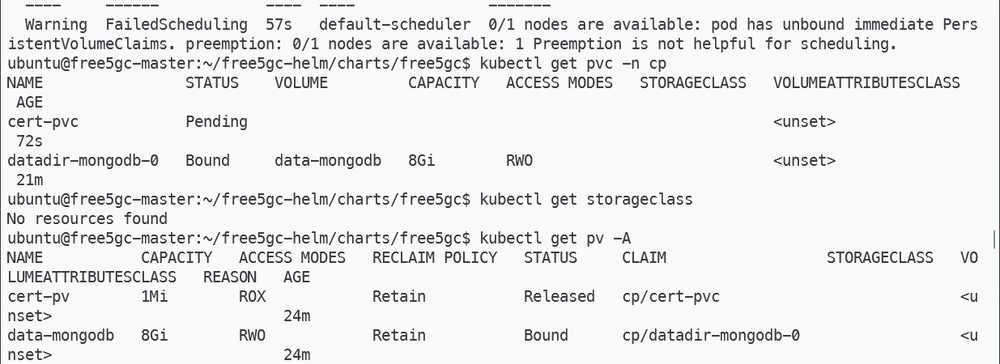

```bash
kubectl patch pv cert-pv --type json -p '[{"op": "remove", "path": "/spec/claimRef"}]'
```

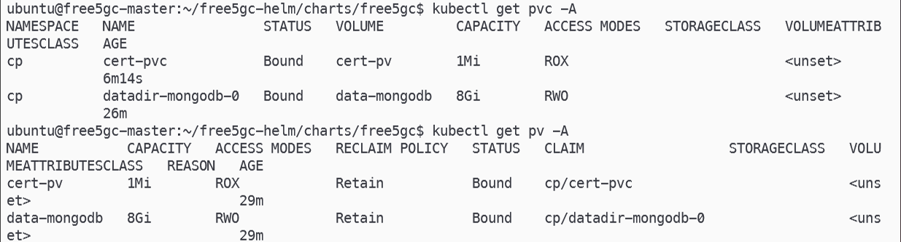
